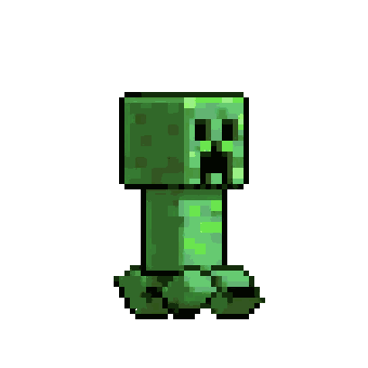

# MineDesktop

A very simple desktop mate program that displays a Minecraft-themed GIF Image.



## Usage

Download the newest release, unzip it, and run `pet.exe`.
 
## Configuration

Themes are configured in `themes.json`:

```python
{
    "themes": [
        {
            "name": "Theme Name",
            "main_gif": "path/to/GIF/image",
            "click_gif": "path/to/animation/image",
            "mode": "wait"
                # wait: After click, a complete cycle of the main GIF will be played before the animation (for better linkage).
                # immediate: The main GIF will be interrupted and the animation will be played immediately after click.
        },
        ...
    ]
}
```

## Build

Clone the repository

```cmd
git clone https://github.com/sclass53/MineDesktop.git .
```

Run
```cmd
pyinstaller --noconsole --onefile pet.py
```

## Disclaimer

This repository contains some animated graphical assets (such as GIFs/WebPs) that are extracted and matted from recorded in-game footage of Minecraft. These assets are not original creations by the theme author; they are derivative visual reproductions of content owned by Mojang Studios / Microsoft.

This project is strictly non-commercial and intended solely for personal, fan-made purposes.

If you are the rightful copyright holder and believe that the inclusion of these extracted assets in this repository infringes upon your intellectual property rights, please contact me immediately via GitHub Issues.
I will conduct a thorough review and remove the disputed assets within 24–48 hours upon receiving your verified request.
